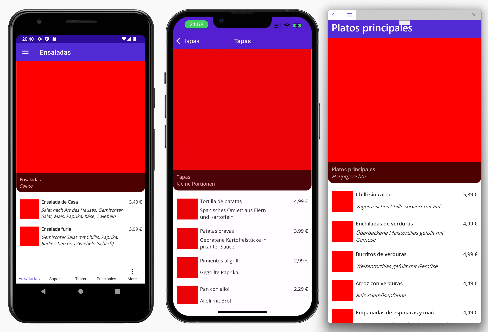

# Übung 6: Navigation

- Legen Sie in Ihrem Projekt `ElVegetarianoFurio` eine neue Seite `CategoryPage.xaml` im Ordner Menu an.
- Legen Sie ein ViewModel `CategoryViewModel` mit den Eigenschaften  `Category` und `Dishes` an. Dishes ist eine ObservableCollection!
- Legen Sie eine Methode zum Laden der Liste der Dishes über den DataService anhand der vorgegebenen Category an
- Verbinden Sie View und ViewModel. 
- Registrieren Sie View und ViewModel in der DependencyInjection und registrieren Sie eine Route für die CategoryPage
- Erstellen Sie das Layout für die Seite `CategoryPage.xaml` anlaog zum Screenshot

